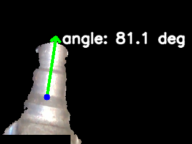
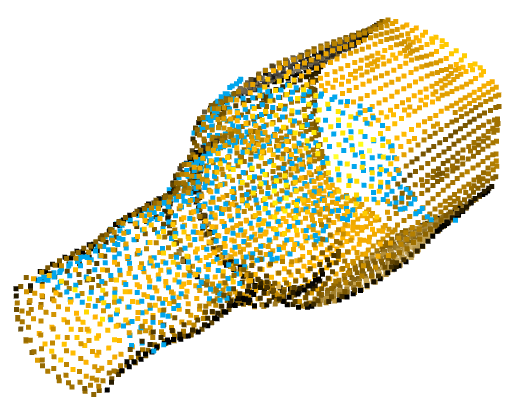

# Pose Corrector Node

A ros node that estimates the 6D pose of a metallic object (named `inboard`) object using RGB-D images.


## Usage

Launch the pose estimator:

```bash
roslaunch pose_corrector run.launch
```

## Task 1 and 2

The processed images can be downloaded from [Dropbox](https://www.dropbox.com/scl/fi/qdewpt0c1vashpqjvtcr1/results_media.zip?rlkey=p0g0vmctulwojhy25oz78qad8&st=uls3zktj&dl=0).  
The dataset images were processed using `pose_corrector_task_1_and_2.py`.

### Depth Segmentation and PCA

The images are segmented based on depth image distances. PCA is then conducted on the resulting image mask to estimate the onboard angle.



#### Images with hands

Images containing hands are discarded and are not utilized for the inboard angle estimation. The hands are detected based on skin color pixels within the masked images.
In the future hands can be segmented and removed from the image masks to enable estimation during hand-object interactions.

## Task 3

To demo the pose estimator online, a ros node `pose_corrector_node.py` was implemented. The node subscribes to the topics from the provided rosbag.
To run the pose estimation node, see [Usage](##Usage).

### ICP Registration

To estimate the pose of the observed inboard, the point cloud model of the inboard is registered with the point cloud captured by the camera. The ICP registration pipeline is only applied to images where the inboard is upright enough (good), as determined by the angle detector in task 2. The detected angle is used to provide an initial transformation for the ICP algorithm.



*The aligned inboard model point cloud (yellow) with camera point cloud (blue)*

### C++ Node

A simple RGB-D image subscriber in C++ can be found in `pose_corrector_node.cpp`. The whole pose estimation pipeline has not been implemented in C++.  
To run the C++ image subscriber:

```bash
roslaunch pose_corrector cpp.launch
```